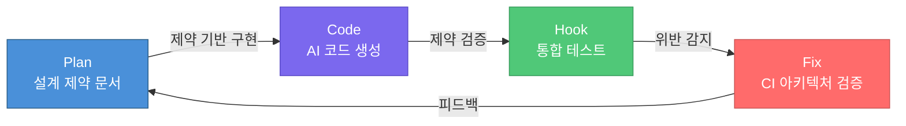
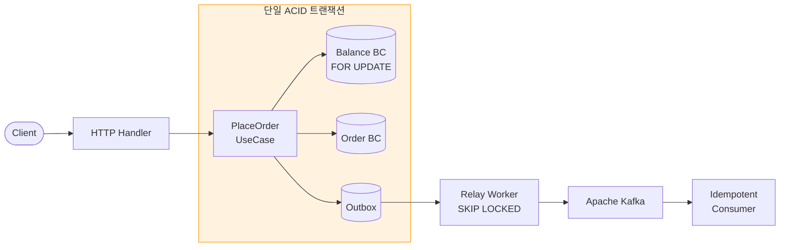

# harness-engineering

> AI 코드 에이전트를 제약 문서로 하네싱하여, 프로덕션급 아키텍처를 생산하는 방법론 데모

**이 프로젝트는 방법론 검증을 위한 토이 프로젝트입니다.** 단순히 AI 코드 에이전트를 사용하는 데 그치지 않고, 하네스 엔지니어링 기법으로 AI를 실제 개발 흐름에 연결해 팀 생산성을 높이는 구조를 실험합니다.

---

## 왜 만들었는가

AI 코드 에이전트는 빠르다. 하지만 **제약 없이** 쓰면 Anemic Domain Model, Dual Write, Cross-BC 직접 결합 같은 안티패턴을 대규모로 생산한다. 생성 속도가 빠를수록 기술 부채도 빠르게 쌓인다.

핵심 인사이트는 단순하다. AI에게 코드를 요청하기 **전에** 명시적 제약 문서(DDD 모델, 상태 머신, 불변식, BDD 시나리오)를 작성하고, 생성된 코드를 자동으로 검증하면, AI는 기술 부채 생성기가 아닌 **팀 생산성 증폭기**가 된다.

"하네스(harness)"는 말의 마구를 뜻한다. 마구가 동력을 방향으로 바꾸듯, 제약 문서가 AI의 생성 능력을 아키텍처 방향으로 제어한다.

---

## 하네스 루프: Plan → Code → Hook → Fix



| 단계 | 문서 | 역할 |
|---|---|---|
| **Plan** | [`docs/01_Plan.md`](docs/01_Plan.md) | 인간이 DDD Aggregate, 상태 머신, 불변식, 이벤트 카탈로그, BDD 시나리오를 선행 정의 |
| **Code** | [`docs/02_Code.md`](docs/02_Code.md) | AI가 제약 문서 기반으로 구현. 디렉토리 구조 = 아키텍처 경계. 패키지 의존성 규칙 명시 |
| **Hook** | [`docs/03_Hook.md`](docs/03_Hook.md) | 실제 MySQL + Kafka 대상 통합 테스트 6종으로 Plan의 모든 제약을 실행 검증 |
| **Fix** | [`docs/04_Fix.md`](docs/04_Fix.md) | `ci/arch-check.sh`가 12개 아키텍처 규칙을 자동 검증. 위반 시 머지 차단 |

**일반 AI 코딩:** 요청 → 코드 생성 → (인간이 리뷰) → 배포

**하네스 엔지니어링:** 제약 선행 정의 → 제약 기반 생성 → 자동 검증 → 피드백 루프 → 독립 감사([`05_Review.md`](docs/05_Review.md): 95% 준수)

---

## 도메인: 가상자산 거래소 주문 서비스

DDD/EDA/MSA의 실제 안티패턴이 발생하는 최소 규모 도메인으로, 방법론 검증에 적합하다.



| Bounded Context | 책임 | 핵심 패턴 |
|---|---|---|
| **Order BC** | 주문 생명주기 (PENDING → ACCEPTED → FILLED / CANCELLED) | 상태 머신 + 가드 조건 |
| **Balance BC** | 사용자 자산 관리 (차감 / 잠금 / 복원 / 정산) | 비관적 락 (`SELECT ... FOR UPDATE`) |
| **Outbox** | 이벤트 안정적 전달 | Transactional Outbox + SKIP LOCKED Relay |

### 기술 스택

Go 1.25 · MySQL 8.0 · Apache Kafka (KRaft) · Docker · sqlx · sarama · shopspring/decimal · chi

---

## 안티패턴 방어 체계

이 프로젝트의 핵심 가치다. 모든 안티패턴에 대해 **해법**과 **자동 강제 메커니즘**이 존재한다.

### DDD 안티패턴

| 안티패턴 | 문제 | 해법 | 강제 |
|---|---|---|---|
| **Anemic Domain Model** | 도메인 엔티티가 데이터 주머니, 로직은 서비스에 산재 | Order에 `Accept()` / `Fill()` / `Cancel()` 상태 머신 + 가드 조건. Balance에 `DeductAndLock()` 불변식 검증. 도메인 이벤트를 Aggregate 내부에서 발행 | `02_Code.md` 제약 + 코드 리뷰 |
| **Domain-Infra 결합** | `domain/`이 `database/sql`이나 `infrastructure/`를 직접 import | `domain/`에 DB import 0건. Repository 인터페이스는 `domain/`에, 구현은 `infrastructure/`에 분리 | `arch-check.sh` **DDD-1, DDD-2, DDD-4** |
| **Leaky Abstraction** | Repository 구현체가 도메인에 노출 | 의존성 역전 원칙: `domain/ → interface ← infrastructure/`. 트랜잭션은 context 기반 `TxManager` 추상화 | `arch-check.sh` **DDD-4** |

### MSA 안티패턴

| 안티패턴 | 문제 | 해법 | 강제 |
|---|---|---|---|
| **Cross-BC 직접 결합** | `order/domain/`이 `balance/`를 직접 import하여 분리 불가능 | `order/domain/`은 `balance/` import 금지. `application/` 계층에서만 인터페이스로 조합 | `arch-check.sh` **MSA-1** |
| **공유 DB 모놀리스** | 같은 MySQL을 쓰면서 코드까지 결합 | 코드 수준 BC 분리 + Outbox 이벤트 계약으로 DB 분리 시 마이그레이션 용이한 구조 선확보 | 디렉토리 구조 + 이벤트 스키마 |
| **API 도메인 엔티티 노출** | Handler가 domain 구조체를 직접 JSON 반환 | Handler는 DTO만 반환 (`PlaceOrderResponse`, `BalanceResponse` 등) | `arch-check.sh` **MSA-3** |

### EDA 안티패턴

| 안티패턴 | 문제 | 해법 | 강제 |
|---|---|---|---|
| **Dual Write** | DB 저장 성공 + Kafka 발행 실패 (또는 반대) → 데이터 불일치 | 비즈니스 엔티티 + Outbox 이벤트를 **단일 ACID 트랜잭션**으로 저장. Kafka 발행은 Relay가 별도 수행 | `arch-check.sh` **EDA-3** |
| **이벤트 유실** | Kafka 장애 시 이벤트 영구 유실 | Outbox가 MySQL에 먼저 저장 (ACID 보장). Relay가 `FOR UPDATE SKIP LOCKED` + 지수 백오프로 재시도. 5분 초과 Stuck 이벤트 감지 | `arch-check.sh` **RELAY-1, RELAY-5** |
| **중복 처리** | Consumer가 동일 이벤트를 여러 번 처리 | `processed_events` 테이블: 조회 → 비즈니스 로직 → 마킹을 **단일 트랜잭션**으로 묶음 | `arch-check.sh` **EDA-2** |
| **무한 재시도** | 실패 이벤트가 무한 재시도되며 큐를 블로킹 | 최대 5회 재시도 → `FAILED` 상태 + DLQ 라우팅 | `arch-check.sh` **EDA-1** |

---

## 핵심 트랜잭션 플로우

주문 생성 시 비관적 락 10단계 플로우. 잠금 순서는 항상 **balance 먼저 → order** (데드락 방지).

```
 1. 멱등성 키 확인 (캐시 히트 → 저장된 응답 반환)
 2. Order 생성 + 필요 금액 계산
 3. BEGIN TX
     4. SELECT ... FROM balances FOR UPDATE    ← 잔고 행 비관적 잠금
     5. balance.DeductAndLock(amount)           ← 잔액 부족 시 ROLLBACK
     6. order.Accept()                          ← PENDING → ACCEPTED + 이벤트 발행
     7. balanceRepo.Save()                      ← UPDATE balances + INSERT outbox
     8. orderRepo.Save()                        ← INSERT orders + INSERT outbox
     9. INSERT idempotency_keys                 ← 중복 API 호출 방어
10. COMMIT
```

---

## 하네스 런타임 (Phase 2)

위 Plan → Code → Hook → Fix 루프가 이제 **기계가 직접 실행하는 런타임**으로 존재한다. docs/01-04 는 단순한 가이드라인이 아니라, 매 Agent iteration 마다 스크립트가 파싱하는 **실행 가능한 계약(executable contract)** 이다.

```
.claude/
├── settings.json                      # Claude Code hook 배선 (4개 이벤트 → 4개 스크립트)
└── harness/
    ├── state.json                     # task 상태 머신 (pending/in_progress/done/blocked)
    ├── lib/
    │   ├── common.sh                  # preflight + 경로 + atomic state I/O
    │   └── plan-to-json.py            # 01_Plan.md yaml → JSON
    └── scripts/
        ├── next-task.sh               # UserPromptSubmit → 다음 task 선택 + 컨텍스트 주입
        ├── validate-plan.sh           # PreToolUse → DAG 불변식 검증 (Plan.md 편집 시)
        ├── check.sh                   # PostToolUse → 12 arch 규칙 + go-build/test/vet
        └── commit-and-advance.sh      # Stop → scope-limited 커밋 + 상태 전이 + escalation
```

**한 iteration 의 흐름:**
1. 사용자 프롬프트 제출 → `next-task.sh` 가 현재 task + exit_criteria 를 에이전트 컨텍스트에 주입
2. 에이전트가 파일 편집 → `check.sh` 가 해당 파일에 적용되는 규칙만 즉시 검증
3. 턴 종료 → `commit-and-advance.sh` 가 전체 규칙 통과 확인 후 **task 선언 파일만** 커밋 + 상태 전이
4. 실패 시 → `last-failure.json` 에 기록, 다음 턴에 04_Fix.md 의 recipe 참조 주입, 3회 연속 실패 시 blocked 처리

**도구 의존성:** `jq`, `python3` + `PyYAML` (preflight 에서 자동 확인)

---

## 프로젝트 구조

```
internal/
├── order/                          # ── Order Bounded Context ──
│   ├── domain/                     # 순수 비즈니스 로직 (인프라 의존 0)
│   ├── application/                # 유스케이스 오케스트레이션
│   ├── infrastructure/             # MySQL 구현
│   └── presentation/               # HTTP 핸들러 + DTO + Kafka Consumer
├── balance/                        # ── Balance Bounded Context ──
│   ├── domain/                     # Aggregate + 불변식
│   └── infrastructure/             # SELECT FOR UPDATE 구현
├── outbox/                         # ── Outbox 인프라 ──
│   ├── relay.go                    # SKIP LOCKED 폴링 + Stuck 감지
│   └── mysql_outbox_repo.go        # 지수 백오프 쿼리
└── shared/                         # ── 공유 도메인 ──
    ├── domain/                     # TxManager, EventProducer, Money VO
    └── infrastructure/             # sqlx 트랜잭션, sarama 프로듀서
```

의존성 규칙 (위반 시 CI에서 차단):

```
[presentation] → [application] → [domain] ← [infrastructure]
```

---

## 빠른 시작

**전제 조건:** Go 1.25+, Docker, Docker Compose, `jq`, `python3` + `PyYAML` (하네스용)

```bash
git clone https://github.com/HongJungWan/harness-engineering.git
cd harness-engineering

make docker-up      # MySQL 8.0 + Kafka (KRaft) 기동
make arch-check     # 12개 아키텍처 규칙 검증
make test           # 통합 테스트 6종 실행 (실제 MySQL + Kafka)
make build && make run  # 서버 실행 (:8080)
```

| 명령어 | 설명 |
|---|---|
| `make build` | 바이너리 빌드 (`bin/harness-order`) |
| `make test` | 전체 테스트 (`-race` 포함) |
| `make lint` | golangci-lint 실행 |
| `make docker-up` | MySQL + Kafka 기동 |
| `make docker-down` | 컨테이너 중지 |
| `make arch-check` | 아키텍처 위반 검사 (12개 규칙) |
| `make kafka-consume` | `order.events` 토픽 실시간 확인 |

---

## 문서

| Phase | 문서 | 내용 |
|---|---|---|
| Design | [`docs/00_Design.md`](docs/00_Design.md) | DDD/EDA/고부하 설계 내러티브 + BDD 시나리오 6종 (배경 문서, 1회 읽기) |
| Plan | [`docs/01_Plan.md`](docs/01_Plan.md) | Task DAG yaml + state.json 스키마 + next-task 알고리즘 + 13 부트스트랩 task |
| Code | [`docs/02_Code.md`](docs/02_Code.md) | 디렉토리 제약, 패키지 의존성 규칙, 비관적 락 트랜잭션 플로우, 코딩 컨벤션 |
| Hook | [`docs/03_Hook.md`](docs/03_Hook.md) | 테스트 인프라 설계, 동시성 barrier, Eventually 폴링, 6개 검증 Hook |
| Fix | [`docs/04_Fix.md`](docs/04_Fix.md) | CI 체크리스트, 12개 자동 아키텍처 검증, 리뷰 프로세스 |
| Review | [`docs/05_Review.md`](docs/05_Review.md) | 독립 검증 보고서 (준수율 95%, 잔여 갭 3건 LOW) |

---

## 라이선스

[MIT License](LICENSE)
